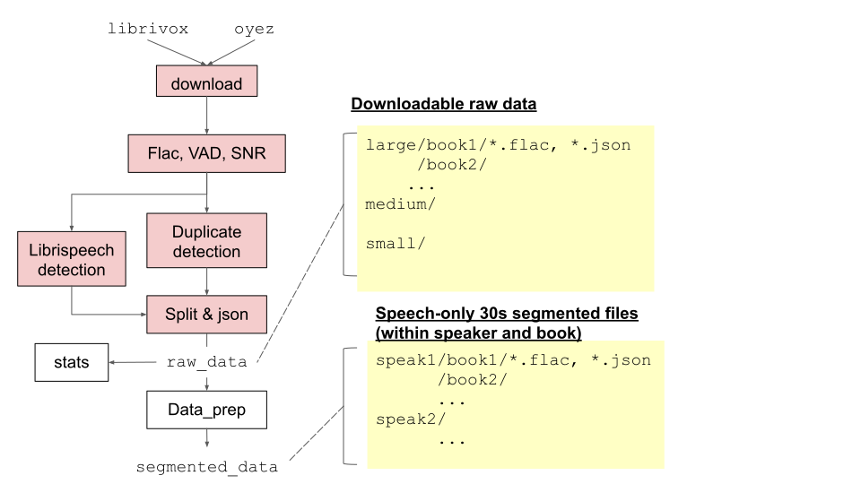

# Libri-light Data Preparation and Download

Below, we provide steps scripts to reconstruct the raw dataset from scratch including data download, conversion into flac,
Voice Activity Detection (VAD) and Signal to Noise (SNR) computation, metadata construction, and dataset filtering and splitting.

All scripts mentioned below can be found in this directory.

## Downloading the Data

### 1. Getting and Preparing the Unlabeled Audio

#### 1A. Downloading

The unlabelled data is spit into 3 subsets of increasing sizes (small, medium, large) in order to facilitate experimentation on smaller amounts of data (further, downloading the large dataset may take several days).

-  [small.tar  (577 hours, 35 GB)](https://dl.fbaipublicfiles.com/librilight/data/small.tar)
    - md5: `c49207eb86a8e8ac895561c37232041e`
-  [medium.tar (5193 hours, 321 GB)](https://dl.fbaipublicfiles.com/librilight/data/medium.tar)
    - md5: `c75e7ac62471bfbf2db77528d62a9b74`
-  [large.tar  (51934 hours, 3.05 TB)](https://dl.fbaipublicfiles.com/librilight/data/large.tar)
    - md5: `4dfbac018f50b99797ece101fc9f0c30`

We additionally provide a 4th subset containing potentially duplicated books.

- [unlab_duplicate.tar  (4500 hours, 274 GB)](https://dl.fbaipublicfiles.com/librilight/data/duplicate.tar)

The directory structure of the audio archives mirrors that of [LibriSpeech](http://www.openslr.org/12):

    dataset_name/speakerID/book_name/

where `dataset_name` is `small`, `medium`, `large`, `duplicate`, `speakerID` is the LibriVox speakerID (a number), and `book_name` the name of the original LibriVox audiobook file. Inside each directory is a set of `.flac` and `.json` files. See below for the format of the `.json` files.

By combining these subsets, one can construct the 3 splits described in the Libri-Light paper:

- *unlab-60k*  : small + medium + large
- *unlab-6k* : small + medium
- *unlab-600*  : small


Once the dataset is downloaded, untarred and organized into a directory (`UNLAB_DIR`) you can check its statistics by running:
```console
    python build_all_stats.py UNLAB_DIR OUTPUT_DIR
```
This will construct, in `OUTPUT_DIR`, two `.png` files (in addition to `.json` files in a `.cache` directory)

#### 1B. Segmenting

Original audio files are long and may not fit into memory.  As a final step, we provide a script to segment the files into roughly 60sec sequences obtained by concatenating consecutive chunks containing voice activity:

```console
    python cut_by_vad.py --input_dir INPUT_DIR --output_dir OUTPUT_DIR
```

`OUTPUT_DIR` will have the same structure as above, but each `file_name` directory will have a list of smaller files (`.flac`). You can modify this step as fits your pipeline and model.

### 2. Get the limited-supervision train data

The limited supervision training sets are built on LibriSpeech. They consist in 10h, 1h, and 10 minute splits with orthographic transciptions and aligned phoneme transcriptions, which can be used to train small models or fine-tune pretrained ones. These can be downloaded here:

- [librispeech_finetuning.tgz  (10 hours, 0.6 GB)](https://dl.fbaipublicfiles.com/librilight/data/librispeech_finetuning.tgz)   

The directory structure is as follows:

     1h/         # data of the 1h split (made up of 6 folds of 10 min)
         0/         # first 10 min fold
           clean/     # 2 speakers, clean
           other/     # 2 speakers, other
         ...      
         5/         # last 10 min fold
           clean/     # 2 speakers, clean
           other/     # 2 speakers, other
     9h/         # remaining data of the 10h split (10h=1h+9h)
         clean /    # 12 speakers, clean
         other/     # 12 speakers, other
     phones/     # phoneme alignment for all of the files


The 10h split is created by combining the data from the `9h/` and the `1h` directories. The 1h split is itself made of 6 folds of 10 min splits. The `phone/` directory contains the frame-wise phoneme transcription of the various splits (the IPA phone mappings are in `phone_mapping.json`). There is also a phoneme transcription of the LibriSpeech `dev` and `test` sets.  
Alternatively, one can reconstruct the dataset by downloading by hand librispeech and running the scripts in `rebuild_limited_train/`.


### 3. Get the dev and test sets (for evaluation)

The standard LibriSpeech dev and test sets are used for evaluation, and can be found at:

    wget http://www.openslr.org/resources/12/dev-clean.tar.gz
    wget http://www.openslr.org/resources/12/dev-other.tar.gz
    wget http://www.openslr.org/resources/12/test-clean.tar.gz
    wget http://www.openslr.org/resources/12/test-other.tar.gz


## Regenerating the Dataset from Scratch (or with books in Another Language!)

Below, we provide the steps needed to completely reproduce generation of the dataset starting from raw LibriVox audio.

First, download the audio data from [LibriVox](https://librivox.org/).
```console
python download_librivox.py $OUTPUT_DOWNLOAD
```

Data can be downloaded in another language. To do so, pass `--language` to above script (for example `--language French`). The amount of available data for each language may differ.

To unzip the data, run:
```console
python unzip_and_convert.py unzip $OUTPUT_DOWNLOAD -o $OUTPUT_MP3
```

And convert them from `.mp3` to flac:
```console
python unzip_and_convert.py convert $OUTPUT_MP3 -o $OUTPUT_FLAC -f .flac
```

### Running Voice Activity Detection and SNR Computation

Voice Activity Detection (VAD) is accomplished using [wav2letter](https://github.com/facebookresearch/wav2letter/). Once you've [downloaded and installed wav2letter](https://github.com/facebookresearch/wav2letter/wiki/General-building-instructions) and its [dependencies](https://github.com/facebookresearch/wav2letter/wiki/Dependencies), make sure the [VAD and Audio Analysis suite](https://github.com/facebookresearch/wav2letter/tree/master/tools#voice-activity-detection-and-audio-analysis) is built.

#### Prepare the Input List file
The wav2letter VAD pipeline expects an [input list file](https://github.com/facebookresearch/wav2letter/wiki/Data-Preparation#audio-and-transcriptions-data) that contains lines with ordered tuples of `[sample ID] [path to sample] [duration]` for each sample.

Run `make_vad_inputs.py` to prepare the data in a list file format for VAD input:
```console
python make_vad_inputs.py \
    --path_db [path to dataset] \
    --extension [audio extension] \
    --path_out [path to output file]
```
If `--path_out` is not specified, each  will be placed in the same directory from which the sample originated.

#### Running VAD

To extract the VAD, given some input list file, follow the instructions to [**run the analysis script**](https://github.com/facebookresearch/wav2letter/blob/master/tools/README.md#voice-activity-detection-and-audio-analysis) with the list file generated in the previous step as the file passed to `--test`.

If `make_vad_inputs.py` is used to generate the input list file, then the [analysis output files](https://github.com/facebookresearch/wav2letter/blob/master/tools/README.md#voice-activity-detection-and-audio-analysis) for each sample will be placed in the same directory as is the sample's original audio.

### Running SNR

To extract the SNR, run:
```console
python calculate_snr.py librivox.lst > calculated_snr.tsv
```

or if the job failed and need to resume you can run
```console
python calculate_snr.py librivox.lst calcuated_snr.tsv > calculated_snr_leftover.tsv
```
This program looks at the VAD output, classifies speech frames and non speech frames base on a dataset specific threshold, removes unclassified frames, and calculates the SNR base on (speech power / non-speech power)

Prerequisite:
- `librivox.lst` is a plain list of all wav filepath downloaded from librivox.org, which looks like this:
```console
/some/path/to/audio1.wav
/some/path/to/audio2.wav
```
- you have to finish the VAD step to have generated the corresponding <wav>.vad file in the same folder as each .wav files
- If you have retrained the VAD model or running on a different dataset, looking at the histogram over some audio files to decide on the threshold is essential for good performance.
- wav file input is required to be 16kHz.

### Preparing Metadata Files

To create metadata files:
```console
python complete_metadata.py --path_metadata $OUTPUT_DOWNLOAD --out_dir $OUTPUT_FLAC --ignore_cache
```

This command will also make the list of all duplicate books at save it at $OUTPUT_FLAC/global/duplicates.json.


Figure 1. Complete data preparation pipeline.

## Metadata JSON File Format

For each LibriVox audio file, we create one JSON metadata file. This differs from the LibriVox distribution, which contains one JSON per book where a single book may have multiple associated audio files.

Below is a labeled example of output metadata produced by the pipeline:

     {
     "speaker" : "960"    # LibriVox speaker ID
     "book_meta": {       # a bunch of LibriVox metadata concerning the book relevant to that file
       "id":  "319"                  # LibriVox book ID
       "title": "History of Holland" # LibriVox book title
       ...                        
       "genre": [                    # LibriVox genre
        "*Non-fiction",
        "History"
         ],                          # from this point, this is our own-libri-light metadata:
       "Dramatic Readings": false,   # boolean for dramatic vs normal reading
       "meta_genre" : "Literature"   # meta-genre among, 7 possibilities
        },                           # ["Literature", "Science, Craft & Essay", "Undefined", "Religion", "Poetry", "Theater", "Ancient"]
     "snr": 5.391,                   # Signal to Noise Ratio computed on the basis of Voice Activity Detection
     "voice_activity": [             # onsets and offsets (in seconds) of each VAD segments
      [
       0.4,
       12.32
       ],
       ...
