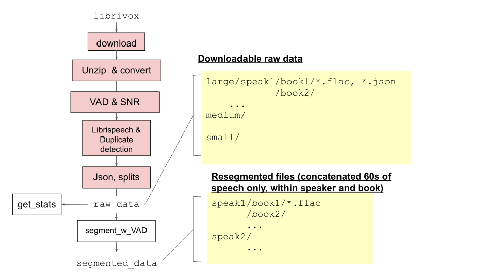

# Libri-light data preparation

Here we provide scripts to reconstruct the raw dataset from scratch, including data download, conversion into flac,
Voice Activity Detection (VAD) and Signal to Noise (SNR) computation,
meta-data construction, and dataset filtering and splitting.

We also provide scripts for preparing the raw dataset into useable segments for model training (segmentation).

